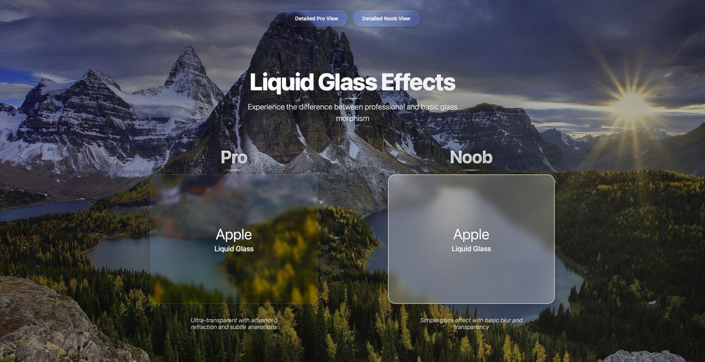

# Liquid Glass Effects - Glass Morphism Comparison

[English](#english) | [ไทย](#thai)

---

## English

### 🎨 Project Overview

**Liquid Glass Effects** is an interactive demonstration showcasing the difference between professional and basic glass morphism implementations. This project provides a visual comparison of advanced vs. simple glass effects using modern CSS techniques.

### ✨ Features

- **Interactive Comparison**: Side-by-side comparison of Pro vs. Noob glass effects
- **Detailed Explanations**: Technical breakdown of what makes each implementation different
- **Responsive Design**: Works perfectly on desktop, tablet, and mobile devices
- **Beautiful UI**: Enhanced with floating particles and gradient backgrounds
- **Navigation System**: Easy switching between different views
- **Locked Layout**: Immersive fullscreen experience on larger screens

### 🚀 Live Demo

**🌐 [View Live Demo](https://liquid-glass-card.vercel.app)**

Experience the difference between professional and basic glass morphism:
- **Pro Version**: Ultra-transparent with advanced refraction and subtle animations
- **Noob Version**: Simple glass effect with basic blur and transparency



### 🛠️ Technical Implementation

#### Pro Glass Effect Features:
- Ultra-transparent background (0.005 opacity)
- Advanced backdrop-filter with saturate(180%) and brightness(105%)
- Subtle refraction animation
- Sophisticated shadow layering
- Glass refraction layer with radial gradients
- Enhanced hover effects with dynamic blur changes
- Micro-interactions and smooth transitions

#### Noob Glass Effect Features:
- High opacity background (0.25 opacity)
- Simple backdrop-filter with only blur(10px)
- No animations or dynamic effects
- Basic shadow with single box-shadow value
- No refraction layers
- Simple hover effect with opacity change
- Limited interactivity

### 📁 Project Structure

```
liquid_glass/
├── index.html          # Main comparison page
├── pro.html           # Detailed Pro version
├── noob.html          # Detailed Noob version
├── style.css          # All styling and animations
├── script.js          # JavaScript functionality
└── README.md          # This file
```

### 🎯 How to Use

1. **Main Page**: View side-by-side comparison of both effects
2. **Pro Detail**: Click "Detailed Pro View" for in-depth explanation
3. **Noob Detail**: Click "Detailed Noob View" for basic implementation details
4. **Navigation**: Use the glass-morphism styled buttons to switch between views

### 🎨 Design Features

- **Glass Morphism**: Modern glass effect with backdrop-filter
- **Responsive Layout**: Adapts beautifully to all screen sizes
- **Smooth Animations**: Subtle hover effects and transitions
- **Colorful Background**: Enhanced with vibrant gradients
- **Professional Typography**: Clean, readable text hierarchy

### 📱 Responsive Design

- **Desktop**: Full immersive experience with locked scrolling
- **Tablet**: Optimized layout with larger cards
- **Mobile**: Touch-friendly interface with proper text sizing

### 🔧 Technologies Used

- **HTML5**: Semantic structure
- **CSS3**: Advanced styling with backdrop-filter, animations, and gradients
- **JavaScript**: Minimal functionality for navigation
- **Modern CSS Features**: 
  - `backdrop-filter`
  - `rgba()` transparency
  - `box-shadow` layering
  - CSS animations
  - Flexbox layout

### 🎯 Learning Objectives

This project demonstrates:
- How to create professional glass morphism effects
- The difference between basic and advanced CSS implementations
- Responsive design best practices
- Modern CSS animation techniques
- User experience optimization

---

## Thai

### 🎨 ภาพรวมโปรเจกต์

**Liquid Glass Effects** เป็นการสาธิตแบบโต้ตอบที่แสดงให้เห็นความแตกต่างระหว่างการใช้งาน glass morphism แบบมืออาชีพและแบบพื้นฐาน โปรเจกต์นี้ให้การเปรียบเทียบภาพของ glass effects แบบขั้นสูงเทียบกับแบบง่ายโดยใช้เทคนิค CSS สมัยใหม่

### ✨ คุณสมบัติ

- **การเปรียบเทียบแบบโต้ตอบ**: เปรียบเทียบ Pro vs. Noob glass effects แบบข้างเคียง
- **คำอธิบายรายละเอียด**: การวิเคราะห์ทางเทคนิคว่าอะไรทำให้แต่ละการใช้งานแตกต่างกัน
- **การออกแบบที่ตอบสนอง**: ทำงานได้อย่างสมบูรณ์บนเดสก์ท็อป แท็บเล็ต และมือถือ
- **UI ที่สวยงาม**: เพิ่มความสวยงามด้วย floating particles และ gradient backgrounds
- **ระบบนำทาง**: การสลับระหว่างมุมมองต่างๆ ได้ง่าย
- **เลย์เอาต์ที่ล็อค**: ประสบการณ์แบบเต็มหน้าจอที่ดื่มด่ำบนหน้าจอขนาดใหญ่

### 🚀 การสาธิตสด

**🌐 [ดูการสาธิตสด](https://liquid-glass-card.vercel.app)**

สัมผัสความแตกต่างระหว่าง glass morphism แบบมืออาชีพและแบบพื้นฐาน:
- **เวอร์ชัน Pro**: โปร่งใสสูงสุดพร้อมการหักเหขั้นสูงและแอนิเมชันที่ละเอียดอ่อน
- **เวอร์ชัน Noob**: glass effect แบบง่ายพร้อม blur และความโปร่งใสพื้นฐาน


### 🛠️ การใช้งานทางเทคนิค

#### คุณสมบัติ Pro Glass Effect:
- พื้นหลังโปร่งใสสูงสุด (opacity 0.005)
- backdrop-filter ขั้นสูงพร้อม saturate(180%) และ brightness(105%)
- แอนิเมชันการหักเหที่ละเอียดอ่อน
- การจัดชั้นเงาที่ซับซ้อน
- ชั้นการหักเหของแก้วพร้อม radial gradients
- hover effects ที่พัฒนาขึ้นพร้อมการเปลี่ยนแปลง blur แบบไดนามิก
- micro-interactions และการเปลี่ยนผ่านที่ราบรื่น

#### คุณสมบัติ Noob Glass Effect:
- พื้นหลังที่มี opacity สูง (opacity 0.25)
- backdrop-filter แบบง่ายพร้อม blur(10px) เท่านั้น
- ไม่มีแอนิเมชันหรือเอฟเฟกต์แบบไดนามิก
- เงาพื้นฐานพร้อมค่า box-shadow เดียว
- ไม่มีชั้นการหักเห
- hover effect แบบง่ายพร้อมการเปลี่ยนแปลง opacity
- การโต้ตอบที่จำกัด

### 📁 โครงสร้างโปรเจกต์

```
liquid_glass/
├── index.html          # หน้าหลักสำหรับเปรียบเทียบ
├── pro.html           # รายละเอียดเวอร์ชัน Pro
├── noob.html          # รายละเอียดเวอร์ชัน Noob
├── style.css          # การจัดสไตล์และแอนิเมชันทั้งหมด
├── script.js          # ฟังก์ชัน JavaScript
└── README.md          # ไฟล์นี้
```

### 🎯 วิธีการใช้งาน

1. **หน้าหลัก**: ดูการเปรียบเทียบแบบข้างเคียงของทั้งสองเอฟเฟกต์
2. **รายละเอียด Pro**: คลิก "Detailed Pro View" สำหรับคำอธิบายแบบละเอียด
3. **รายละเอียด Noob**: คลิก "Detailed Noob View" สำหรับรายละเอียดการใช้งานพื้นฐาน
4. **การนำทาง**: ใช้ปุ่มที่จัดสไตล์แบบ glass-morphism เพื่อสลับระหว่างมุมมอง

### 🎨 คุณสมบัติการออกแบบ

- **Glass Morphism**: glass effect สมัยใหม่พร้อม backdrop-filter
- **เลย์เอาต์ที่ตอบสนอง**: ปรับตัวได้สวยงามกับทุกขนาดหน้าจอ
- **แอนิเมชันที่ราบรื่น**: hover effects และการเปลี่ยนผ่านที่ละเอียดอ่อน
- **พื้นหลังที่มีสีสัน**: เพิ่มความสวยงามด้วย gradients ที่สดใส
- **การจัดตัวอักษรแบบมืออาชีพ**: ลำดับชั้นข้อความที่สะอาดและอ่านง่าย

### 📱 การออกแบบที่ตอบสนอง

- **เดสก์ท็อป**: ประสบการณ์แบบดื่มด่ำเต็มหน้าจอพร้อมการล็อคการเลื่อน
- **แท็บเล็ต**: เลย์เอาต์ที่ปรับให้เหมาะสมพร้อมการ์ดขนาดใหญ่
- **มือถือ**: อินเทอร์เฟซที่เหมาะสำหรับการสัมผัสพร้อมการปรับขนาดข้อความที่เหมาะสม

### 🔧 เทคโนโลยีที่ใช้

- **HTML5**: โครงสร้างเชิงความหมาย
- **CSS3**: การจัดสไตล์ขั้นสูงพร้อม backdrop-filter, แอนิเมชัน และ gradients
- **JavaScript**: ฟังก์ชันขั้นต่ำสำหรับการนำทาง
- **คุณสมบัติ CSS สมัยใหม่**:
  - `backdrop-filter`
  - `rgba()` ความโปร่งใส
  - การจัดชั้น `box-shadow`
  - CSS animations
  - Flexbox layout

### 🎯 วัตถุประสงค์การเรียนรู้

โปรเจกต์นี้สาธิต:
- วิธีการสร้าง glass morphism effects แบบมืออาชีพ
- ความแตกต่างระหว่างการใช้งาน CSS แบบพื้นฐานและขั้นสูง
- แนวปฏิบัติที่ดีที่สุดสำหรับการออกแบบที่ตอบสนอง
- เทคนิค CSS animation สมัยใหม่
- การปรับปรุงประสบการณ์ผู้ใช้

---

## 📄 License

This project is open source and available under the [MIT License](https://github.com/PhacPha).

โปรเจกต์นี้เป็น open source และมีให้ภายใต้ [MIT License](https://github.com/PhacPha) 